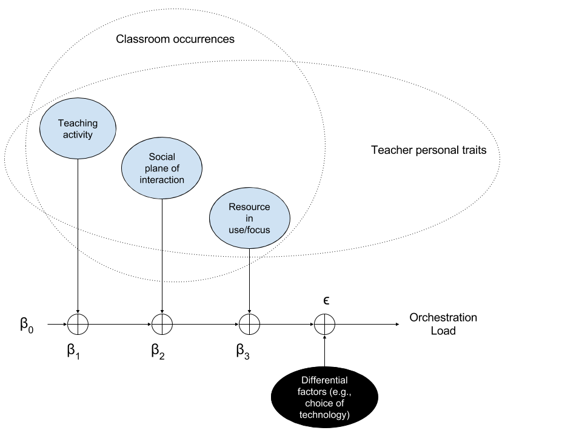
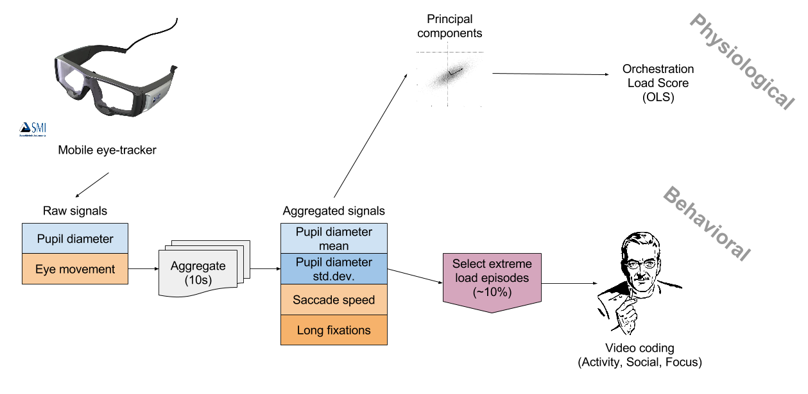

# Introduction and Goals

For now, please refer to the [manuscript](https://github.com/chili-epfl/paper-IEEETLT-orchestrationload/tree/master/manuscript)  if you want a full description of the aims of the study, the models proposed and the methods employed for the measurement of orchestration load using eye-tracking and behavioral measures. The main pictures are included below as a memory aid.

# Our (linear) model of Orchestration Load




# Methodology



# Study results

The [manuscript](https://github.com/chili-epfl/paper-IEEETLT-orchestrationload/tree/master/manuscript) describes in more detail the context of the four studies

In the sections below, we reproduce the analyses done for the paper, from the raw data. These raw datasets have been made available separately for each study:

* [Dataset for Study 1 (Laptop-based sessions, university, comparison between expert and novice teacher)](https://zenodo.org/record/16514)
* Datasets for Study 2 (secondary school, expert teacher, either using [usual laptop-based technology](https://zenodo.org/record/16551/) or [novel tabletop technology](https://zenodo.org/record/198681), [+erratum](https://zenodo.org/record/203958))
* [Dataset for Study 3 (Multi-tabletop sessions in the lab, primary school students, with/without a helper)](https://zenodo.org/record/198709) [+erratum 1](https://zenodo.org/record/204063) [+erratum2](https://zenodo.org/record/204819)
* [Dataset for Study 4 (Multi-tabletop sessions in the lab, primary school students, unmanipulated setting)](https://zenodo.org/record/16515)

## Loading, cleanup and preprocessing of data

We download the raw data, uncompress and preprocess it, until we have the 10-second episodes and the different eye-tracking and video-coded parameters of each episode (see the separate `./lib/preprocessStudyX.R` files).

```{r, message=FALSE, warning=FALSE, echo=FALSE}
source("./lib/preprocessStudy1.R")
preprocessStudy1()
source("./lib/preprocessStudy2.R")
preprocessStudy2()
source("./lib/preprocessStudy3.R")
preprocessStudy3()
source("./lib/preprocessStudy4.R")
preprocessStudy4()
```

The preprocessing scripts leave the clean, preprocessed data (almost) ready for modelling in `./data/studyX/studyXProcessedData.Rda`. We now solve a few inconsistencies in labelling, cap outliers in the saccades variable (measurement errors) and create the "ground truth" variable, for convenience and readability.

```{r, message=FALSE, warning=FALSE, echo=FALSE}
source("./lib/outliers.R")
source("./lib/loadIndex.R")

# Data for study 1: solve labelling inconsistencies across studies
data1 <- get(load("./data/study1/study1ProcessedData.Rda"))
data1$Study <- 1
levels(data1$Focus)[levels(data1$Focus)=="TAB"] <- "DSK"
levels(data1$Focus)[levels(data1$Focus)=="WHIT"] <- "WHI"
levels(data1$Activity)[levels(data1$Activity)=="QUEST"] <- "QUE"
# Cleanup of unused fields
data1 <- data1[,-c(7:10)]
# Reorder the columns to be consistent across studies
data1 <- data1[,c(1:6,9,8,7,10)]
data1$GroundTruth <- ifelse(data1$session=="DELANA-Session3-Novice-eyetracking",1,ifelse(data1$session=="DELANA-Session1-Expert-eyetracking" | data1$session=="DELANA-Session2-Expert-eyetracking",0,NA))
data1 <- data1[!is.na(data1$value.Sac),] # remove samples where it was NA
#countOutliers(data1$value.Sac,coef = 10, method="iqr") # 5xinter-quartile range seems like a reasonable boundary for outliers
data1$value.Sac <- replaceOutliers(data1$value.Sac,valueNA = F,coef = 10, method="iqr") # We crop outliers beyond 10xinter-quartile range, giving them the value 5xIQR
data1$Social <- as.character(data1$Social)
data1$Activity <- as.character(data1$Activity)
data1$Focus <- as.character(data1$Focus)
# Solve inconsistency with other studies labels
data1[data1$GroundTruth==1,"Subject"] <- "K"
data1[data1$GroundTruth==0,"Subject"] <- "P"


# Data for study 2: solve labelling inconsistencies across studies
data2 <- get(load("./data/study2/study2ProcessedData.Rda"))
data2$Study <- 2
levels(data2$Focus)[levels(data2$Focus)=="LAP"] <- "SCOMP"
levels(data2$Focus)[levels(data2$Focus)=="PRJ"] <- "PROJ"
# Cleanup of unused fields
data2 <- data2[,-c(7:10)]
# Reorder the columns as in other studies
data2 <- data2[,c(1:6,9,8,7,10)]
data2$GroundTruth <- ifelse(data2$session=="ISL2015NOVEL-Session1-eyetracking" | data2$session=="ISL2015NOVEL-Session2-eyetracking",1,ifelse(data2$session=="ISL2014BASELINE-Session1-eyetracking" | data2$session=="ISL2014BASELINE-Session2-eyetracking",0,NA))
data2 <- data2[!is.na(data2$value.Sac),] # remove samples where it was NA
#countOutliers(data2$value.Sac,coef = 5, method="iqr") # 5xinter-quartile range seems like a reasonable boundary for outliers
data2$value.Sac <- replaceOutliers(data2$value.Sac,valueNA = F,coef = 10, method="iqr") # We crop outliers beyond 10xinter-quartile range, giving them the value 5xIQR
data2$Social <- as.character(data2$Social)
data2$Activity <- as.character(data2$Activity)
data2$Focus <- as.character(data2$Focus)
data2$Subject <- "W"


# Data for study 3 solve labelling inconsistencies across studies
data3 <- get(load("./data/study3/study3ProcessedData.Rda"))
data3$Study <- 3
# Cleanup of study 3 data
names(data3)[7:10] <- c("Experimental","Social","Activity","Focus")
# from the preprocessing, the categorical values have too many levels, we fix it
data3$Experimental <- factor(data3$Experimental)
data3$Social <- factor(data3$Social)
data3$Activity <- factor(data3$Activity)
data3$Focus <- factor(data3$Focus)
data3$GroundTruth <- ifelse(data3$Experimental=="C2",1,ifelse(data3$Experimental=="C1",0,NA))
data3 <- data3[,-7] # Remove Experimental, now substituted by GroundTruth
data3 <- data3[!is.na(data3$value.Sac),] # remove samples where it was NA
#countOutliers(data3$value.Sac,coef = 5, method="iqr") # 5xinter-quartile range seems like a reasonable boundary for outliers
data3$value.Sac <- replaceOutliers(data3$value.Sac,valueNA = F,coef = 10, method="iqr") # We crop outliers beyond 10xinter-quartile range, giving them the value 5xIQR
data3$Social <- as.character(data3$Social)
data3$Activity <- as.character(data3$Activity)
data3$Focus <- as.character(data3$Focus)
data3$Subject <- "L"

# Data for study 4: solve labelling inconsistencies across studies
data4 <- get(load("./data/study4/study4ProcessedData.Rda"))
data4$Study <- 4
# Cleanup of study 4 data
data4 <- data4[,-c(7:9)]
# Reorder the columns as in data4
data4 <- data4[,c(1:6,8,7,9,10)]
data4$GroundTruth <- NA
data4 <- data4[!is.na(data4$value.Sac),] # remove samples where it was NA
#countOutliers(data4$value.Sac,coef = 10, method="iqr") # 5xinter-quartile range seems like a reasonable boundary for outliers
data4$value.Sac <- replaceOutliers(data4$value.Sac,valueNA = F,coef = 10, method="iqr") # We crop outliers beyond 10xinter-quartile range, giving them the value 5xIQR
levels(data4$Social) <- c("CLS","GRP")
data4$Social <- as.character(data4$Social)
data4$Activity <- as.character(data4$Activity)
data4$Focus <- as.character(data4$Focus)
data4$Subject <- "L"

# Join all studies' data
totaldata <- rbind(data1,data2,data3,data4)

# Calculate different normalizations of the eyetracking metrics, and the basic load indices
# The basic load index, "CoarseLoad" is used for the sampling of 'agreement episodes' to be coded (we video code episodes with basic load index of 0 or 4)
loaddata <- calculateLoadIndexAndNormalizations(totaldata,3:6,stablenorm = 3)

# Write to disk the clean datafile
write.csv(loaddata,file="./data/loaddata-clean.csv")

```


## Overall dataset operation: Calculate Orchestration Load Score (OLS = 1st PCA score)

```{r, message=FALSE, warning=FALSE}
# We calculate the PCA load index (score in the 1st PCA component)
library(FactoMineR)
pca.global = PCA(loaddata[, 3:6], scale.unit=TRUE, ncp=2, graph=F)
plot.PCA(pca.global, axes=c(1, 2), choix="var", title="PCA All studies")
# We add the PCA load index to our dataset
loaddata$PCALoad1 = pca.global$ind$coord[,1]
loaddata$PCALoad2 = pca.global$ind$coord[,2] # We keep the second dimension too, just in case

# To build up the statistical models, we clean up further the dataset, 
# to keep only those samples for which we have videocoded process variables
behdata <- loaddata[!is.na(loaddata$Activity) & !is.na(loaddata$Social) & !is.na(loaddata$Focus) & !is.na(loaddata$GroundTruth),]

behdata$Activity <- factor(behdata$Activity)
behdata$Social <- factor(behdata$Social)
behdata$Focus <- factor(behdata$Focus)

# We relevel the factors so that the intercept is a combination that exists in all case studies: MON/CLS/FAC
behdata <- within(behdata, Activity <- relevel(Activity, ref = "MON"))
behdata <- within(behdata, Social <- relevel(Social, ref = "CLS"))
behdata <- within(behdata, Focus <- relevel(Focus, ref = "FAC"))


# See the order of factor levels
table(behdata$Activity)
table(behdata$Social)
table(behdata$Focus)

# Overall spot check: is OLS globally a good predictor of the GroundTruth (as defined by each of the studies)?
# We train an overall logistic regression model
lr1 <- glm(GroundTruth ~ Activity + Social + Focus + PCALoad1, family=binomial(link='logit'), data=behdata)
summary(lr1)
anova(lr1, test="Chisq") # PCA Load is a very significant predictor
1 - (lr1$deviance / lr1$null.deviance) # Pseudo-rsquared: 0.239

# Check that PCAs are good enough to capture the variance of the individual eyetracking metrics
# explained deviance is similar to this fully-optimized case
lr1b <- glm(GroundTruth ~ Activity + Social + Focus + value.Mean + value.SD + value.Sac + value.Fix, family=binomial(link='logit'), data=behdata)
summary(lr1b)
anova(lr1b, test="Chisq") # Eyetracking metrics are also significant predictors
1 - (lr1b$deviance / lr1b$null.deviance) # Pseudo-rsquared: 0.242 (very close to the PCA one -- the PCA captures most of the meaningful variance)

```

## Study 1: Validating the measure by manipulating teacher expertise

```{r, message=FALSE, warning=FALSE}

# We train and evaluate for each study separately
# Study 1
behdata1 <- behdata[behdata$Study==1,]
# ... and we remove the samples with categorical variables that appear only very seldom
behdata1$Activity <- factor(behdata1$Activity)
behdata1 <- behdata1[behdata1$Social!="GRP",]
behdata1$Social <- factor(behdata1$Social)
behdata1 <- behdata1[behdata1$Focus!="TEA",]
behdata1 <- behdata1[behdata1$Focus!="BAK",]
behdata1$Focus <- factor(behdata1$Focus)

# See the order of factor levels
table(behdata1$Activity)
table(behdata1$Social)
table(behdata1$Focus)


lr1 <- glm(GroundTruth ~ Activity + Social + Focus + PCALoad1, family=binomial(link='logit'), data=behdata1) # OLS is a significant predictor
summary(lr1)
anova(lr1, test="Chisq") # OLS is a significant predictor
1 - (lr1$deviance / lr1$null.deviance) # Pseudo-rsquared=0.88

```

```{r, results="asis"}
# Generate the Latex table for the manuscript
library(xtable)
xtable(summary(lr1)$coefficients, digits = c(0,2,2,2,3))

```

### Study 2: Validating the measure by manipulating familiarity with technology setup

```{r, message=FALSE, warning=FALSE}

# Study 2
behdata2 <- behdata[behdata$Study==2,]
# ... and we remove the samples with categorical variables that appear only very seldom
behdata2 <- behdata2[behdata2$Activity!="DISC",]
behdata2$Activity <- factor(behdata2$Activity)
behdata2$Social <- factor(behdata2$Social)
behdata2 <- behdata2[behdata2$Focus!="TNG",]
behdata2 <- behdata2[behdata2$Focus!="RES",]
behdata2 <- behdata2[behdata2$Focus!="BAK",]
behdata2$Focus <- factor(behdata2$Focus)

# See the order of factor levels
table(behdata2$Activity)
table(behdata2$Social)
table(behdata2$Focus)

lr2 <- glm(GroundTruth ~ Activity + Social + Focus + PCALoad1, family=binomial(link='logit'), data=behdata2) # OLS is a significant predictor
summary(lr2)
anova(lr2, test="Chisq") # OLS is a significant predictor
1 - (lr2$deviance / lr2$null.deviance) # Pseudo-rsquared: 0.75


```

```{r, results="asis"}
# Generate the Latex table for the manuscript
xtable(summary(lr2)$coefficients, digits = c(0,2,2,2,3))
```


### Study 3: Validating the measure by manipulating additional help

```{r, message=FALSE, warning=FALSE}

# Study 3
# Considering agreement episodes only (from CoarseLoad score)
behdata3 <- behdata[behdata$Study==3 & behdata$CoarseLoad %in% c(0,4),]
behdata3 <- behdata3[behdata3$Activity!="OFF",]
behdata3$Activity <- factor(behdata3$Activity)
behdata3 <- behdata3[behdata3$Social!="IND",]
behdata3$Social <- factor(behdata3$Social)
behdata3 <- behdata3[behdata3$Focus!="TCOMP",]
behdata3 <- behdata3[behdata3$Focus!="TD",]
behdata3 <- behdata3[behdata3$Focus!="TEA",]
behdata3 <- behdata3[behdata3$Focus!="TPAP",]
behdata3$Focus <- factor(behdata3$Focus) # -- only 163 samples left after cleaning!

# See the order of factor levels
table(behdata3$Activity)
table(behdata3$Social)
table(behdata3$Focus)


lr3 <- glm(GroundTruth ~ Activity + Social + Focus + PCALoad1, family=binomial(link='logit'), data=behdata3) # OLS coefficient goes in the right direction, but is not significant
summary(lr3)
anova(lr3, test="Chisq") # OLS is not significant predictor (p=0.12)
1 - (lr3$deviance / lr3$null.deviance) # Pseudo-rsquared=0.05


```

```{r, results="asis"}
# Generate the Latex table for the manuscript
xtable(summary(lr3)$coefficients, digits = c(0,2,2,2,3))

```

### Study 4: Seeing orchestration load trends in unmanipulated setting

```{r, message=FALSE, warning=FALSE}
# Study 4
behdata4 <- loaddata[!is.na(loaddata$Activity) & !is.na(loaddata$Social) & !is.na(loaddata$Focus) & loaddata$Study==4,]
# ... and we remove the samples with categorical variables that appear only very seldom
behdata4$Activity <- factor(behdata4$Activity)
behdata4$Social <- factor(behdata4$Social)
behdata4 <- behdata4[behdata4$Focus!="W",]
behdata4 <- behdata4[behdata4$Focus!="M",]
behdata4 <- behdata4[behdata4$Focus!="RES",]
behdata4$Focus <- factor(behdata4$Focus)

behdata4 <- within(behdata4, Activity <- relevel(Activity, ref = "MON"))
behdata4 <- within(behdata4, Social <- relevel(Social, ref = "CLS"))
behdata4 <- within(behdata4, Focus <- relevel(Focus, ref = "FAC"))

# See the order of factor levels
table(behdata4$Activity)
table(behdata4$Social)
table(behdata4$Focus)


# Assuming the OLS is a good indicator, what can we say about the load of the situation?
behdata4$session <- factor(behdata4$session)
lm4sess <- lm(PCALoad1 ~ Activity + Social + Focus + session, data=behdata4)
summary(lm4sess)
anova(lm4sess)

```


```{r, results="asis"}
# Generate the Latex table for the manuscript
xtable(summary(lm4sess)$coefficients, digits = c(0,2,2,2,3))

```


## Discussion: Orchestration load trends and patterns 

Assuming the OLS is a good enough measure of instantaneous orchestration load, what do the linear statistical models tell us about what factors tend to be associated with higher/lower loads? (i.e., the big table in the manuscript discussion, with significant predictors and effect sizes)

We build a model per study (similar to those of Study 4 in the manuscript), and different aggregations of the studies' data according to different factors. We store the effect sizes (Cohen's d) of the significant factors/predictors, and build a big summary table at the end.

### Study 1 trends

```{r message=F, warning=F}


# Assuming the PCALoad is a good indicator, what can we say about the load of the situation?
lm1 <- lm(PCALoad1 ~ Activity + Social + Focus, data=behdata1)
summary(lm1)
anova(lm1)
# Significant trends in the linear model
s <- sd(behdata1$PCALoad1)
# Effect sizes of the significant coefficients
sizes <- (summary(lm1)$coefficients[summary(lm1)$coefficients[,4]<0.05,1])/s # Cohen's d

# Some trends/differences among teachers (not quite significant, tho)

# Expert teacher
lm1exp <-lm(PCALoad1 ~ Activity + Social + Focus, data=behdata1[behdata1$GroundTruth==0,])
summary(lm1exp)
anova(lm1exp)
# Effect sizes of the significant coefficients
sizes <- (summary(lm1exp)$coefficients[summary(lm1exp)$coefficients[,4]<0.05,1])/s
results1exp <- data.frame(Case="1",Teacher="A",Expertise="Expert",Technology="Laptops+Projector",Students="Young adults", stringsAsFactors = F)
results1exp$No.sessions <- length(unique(behdata1[behdata1$GroundTruth==0,"session"]))
results1exp$No.episodes <- sum(table(behdata1[behdata1$GroundTruth==0,"Activity"]))
results1exp$Rsquared.adj <- summary(lm1exp)$adj.r.squared
if(length(names(sizes))==0){
  results1exp$Intercept <- sizes
} else {
  results1exp <- cbind(results1exp,as.data.frame(t(sizes)))
  if(names(results1exp)[9]=="(Intercept)") names(results1exp)[9] <- "Intercept" 
} 

# Novice teacher
lm1nov <-lm(PCALoad1 ~ Activity + Social + Focus, data=behdata1[behdata1$GroundTruth==1,])
summary(lm1nov)
anova(lm1nov)
# Effect sizes of the significant coefficients
sizes <- (summary(lm1nov)$coefficients[summary(lm1nov)$coefficients[,4]<0.05,1])/s

results1nov <- data.frame(Case="1",Teacher="B",Expertise="Novice",Technology="Laptops+Projector",Students="Young adults", stringsAsFactors = F)
results1nov$No.sessions <- length(unique(behdata1[behdata1$GroundTruth==1,"session"]))
results1nov$No.episodes <- sum(table(behdata1[behdata1$GroundTruth==1,"Activity"]))
results1nov$Rsquared.adj <- summary(lm1nov)$adj.r.squared
if(length(names(sizes))==0){
  results1nov$Intercept <- sizes
} else {
  results1nov <- cbind(results1nov,as.data.frame(t(sizes)))
  if(names(results1nov)[9]=="(Intercept)") names(results1nov)[9] <- "Intercept" 
} 

```


### Study 2 trends

```{r message=F, warning=F}


# Assuming the PCALoad is a good indicator, what can we say about the load of the situation?
lm2 <- lm(PCALoad1 ~ Activity + Social + Focus, data=behdata2)
summary(lm2)
anova(lm2)
# Significant trends in the linear model
s <- sd(behdata2$PCALoad1)
# Effect sizes of the significant coefficients
sizes <- (summary(lm2)$coefficients[summary(lm2)$coefficients[,4]<0.05,1])/s


# Some trends/differences among technology setups
lm2usu <-lm(PCALoad1 ~ Activity + Social + Focus, data=behdata2[behdata2$GroundTruth==0,])
summary(lm2usu)
anova(lm2usu)
# Effect sizes of the significant coefficients
sizes <- (summary(lm2usu)$coefficients[summary(lm2usu)$coefficients[,4]<0.05,1])/s

results2usu <- data.frame(Case="2",Teacher="C",Expertise="Expert",Technology="Laptops+Projector",Students="11-12yrs", stringsAsFactors = F)
results2usu$No.sessions <- length(unique(behdata2[behdata2$GroundTruth==0,"session"]))
results2usu$No.episodes <- sum(table(behdata2[behdata2$GroundTruth==0,"Activity"]))
results2usu$Rsquared.adj <- summary(lm2usu)$adj.r.squared
if(length(names(sizes))==0){
  results2usu$Intercept <- sizes
} else {
  results2usu <- cbind(results2usu,as.data.frame(t(sizes)))
  if(names(results2usu)[9]=="(Intercept)") names(results2usu)[9] <- "Intercept" 
} 


lm2nov <-lm(PCALoad1 ~ Activity + Social + Focus, data=behdata2[behdata2$GroundTruth==1,])
summary(lm2nov)
anova(lm2nov)
# Effect sizes of the significant coefficients
sizes <- (summary(lm2nov)$coefficients[summary(lm2nov)$coefficients[,4]<0.05,1])/s
results2nov <- data.frame(Case="2",Teacher="C",Expertise="Expert",Technology="Tabletops+Projector",Students="11-12yrs", stringsAsFactors = F)
results2nov$No.sessions <- length(unique(behdata2[behdata2$GroundTruth==1,"session"]))
results2nov$No.episodes <- sum(table(behdata2[behdata2$GroundTruth==1,"Activity"]))
results2nov$Rsquared.adj <- summary(lm2nov)$adj.r.squared
if(length(names(sizes))==0){
  results2nov$Intercept <- sizes
} else {
  results2nov <- cbind(results2nov,as.data.frame(t(sizes)))
  if(names(results2nov)[9]=="(Intercept)") names(results2nov)[9] <- "Intercept" 
} 
```


### Study 3 trends

```{r message=F, warning=F}

# We take the whole behavioral data, not only the comparable parts
bdata3 <- loaddata[!is.na(loaddata$Activity) & !is.na(loaddata$Social) & !is.na(loaddata$Focus) & loaddata$Study==3,]
# ... and we remove the samples with categorical variables that appear only very seldom
bdata3 <- bdata3[bdata3$Activity!="OFF",]
bdata3$Activity <- factor(bdata3$Activity)
bdata3 <- bdata3[bdata3$Social!="IND",]
bdata3$Social <- factor(bdata3$Social)
bdata3 <- bdata3[bdata3$Focus!="TD",]
bdata3$Focus <- factor(bdata3$Focus)

bdata3 <- within(bdata3, Activity <- relevel(Activity, ref = "MON"))
bdata3 <- within(bdata3, Social <- relevel(Social, ref = "CLS"))
bdata3 <- within(bdata3, Focus <- relevel(Focus, ref = "FAC"))

# Assuming the PCALoad is a good indicator, what can we say about the load of the situation?
# With all the coded episodes
lm3 <- lm(PCALoad1 ~ Activity + Social + Focus, data=bdata3)
summary(lm3)
anova(lm3)
# Significant trends in the linear model
s <- sd(bdata3$PCALoad1)
# Effect sizes of the significant coefficients
sizes <- (summary(lm3)$coefficients[summary(lm3)$coefficients[,4]<0.05,1])/s
results3 <- data.frame(Case="3",Teacher="D",Expertise="Novice",Technology="Tabletops+Projector",Students="10-12yrs", stringsAsFactors = F)
results3$No.sessions <- length(unique(bdata3[,"session"]))
results3$No.episodes <- sum(table(bdata3[,"Activity"]))
results3$Rsquared.adj <- summary(lm3)$adj.r.squared
if(length(names(sizes))==0){
  results3$Intercept <- sizes
} else {
  results3 <- cbind(results3,as.data.frame(t(sizes)))
  if(names(results3)[9]=="(Intercept)") names(results3)[9] <- "Intercept" 
} 

```


### Study 4 trends

```{r message=F, warning=F}

# Assuming the PCALoad is a good indicator, what can we say about the load of the situation?
lm4 <- lm(PCALoad1 ~ Activity + Social + Focus, data=behdata4)
summary(lm4)
anova(lm4)
# Significant trends in the linear model
s <- sd(behdata4$PCALoad1)
# Effect sizes of the significant coefficients
sizes <- (summary(lm4)$coefficients[summary(lm4)$coefficients[,4]<0.05,1])/s
results4 <- data.frame(Case="4",Teacher="D",Expertise="Novice",Technology="Tabletops only",Students="10-12yrs", stringsAsFactors = F)
results4$No.sessions <- length(unique(behdata4[,"session"]))
results4$No.episodes <- sum(table(behdata4[,"Activity"]))
results4$Rsquared.adj <- summary(lm4)$adj.r.squared
if(length(names(sizes))==0){
  results4$Intercept <- sizes
} else {
  results4 <- cbind(results4,as.data.frame(t(sizes)))
  if(names(results4)[9]=="(Intercept)") names(results4)[9] <- "Intercept" 
} 

```


### Aggregating studies: Laptops vs. Tabletops classrooms

```{r message=F, warning=F}
################################################################
# Laptops: data1+data2usu
behdata2lap <- behdata2[behdata2$GroundTruth==0,]

behdatalap <- rbind(behdata1,behdata2lap)
behdatalap$Activity <- factor(behdatalap$Activity)
behdatalap$Social <- factor(behdatalap$Social)
behdatalap$Focus <- factor(behdatalap$Focus)

table(behdatalap$Activity)
table(behdatalap$Social)
table(behdatalap$Focus)

# Assuming the PCALoad is a good indicator, what can we say about the load of the situation?
lmlap <- lm(PCALoad1 ~ Activity + Social + Focus, data=behdatalap)
summary(lmlap)
anova(lmlap)
# Significant trends in the linear model
s <- sd(behdatalap$PCALoad1)
# Effect sizes of the significant coefficients
sizes <- (summary(lmlap)$coefficients[summary(lmlap)$coefficients[,4]<0.05,1])/s
resultslap <- data.frame(Case="1+2",Teacher="A+B+C",Expertise="Varied",Technology="Laptops+Projector",Students="Varied", stringsAsFactors = F)
resultslap$No.sessions <- length(unique(behdatalap[,"session"]))
resultslap$No.episodes <- sum(table(behdatalap[,"Activity"]))
resultslap$Rsquared.adj <- summary(lmlap)$adj.r.squared
if(length(names(sizes))==0){
  resultslap$Intercept <- sizes
} else {
  resultslap <- cbind(resultslap,as.data.frame(t(sizes)))
  if(names(resultslap)[9]=="(Intercept)") names(resultslap)[9] <- "Intercept" 
} 


################################################################
# Tabletops: data2nov+data3+data4
behdata2tab <- behdata2[behdata2$GroundTruth==1,]

behdatatab <- rbind(behdata4,behdata2tab,bdata3)
behdatatab$Activity <- factor(behdatatab$Activity)
behdatatab$Social <- factor(behdatatab$Social)
behdatatab$Focus <- factor(behdatatab$Focus)

table(behdatatab$Activity)
table(behdatatab$Social)
table(behdatatab$Focus)

# Assuming the PCALoad is a good indicator, what can we say about the load of the situation?
lmtab <- lm(PCALoad1 ~ Activity + Social + Focus, data=behdatatab)
summary(lmtab)
anova(lmtab)
# Significant trends in the linear model
s <- sd(behdatatab$PCALoad1)
# Effect sizes of the significant coefficients
sizes <- (summary(lmtab)$coefficients[summary(lmtab)$coefficients[,4]<0.05,1])/s
resultstab <- data.frame(Case="2+3+4",Teacher="C+D",Expertise="Varied",Technology="Tabletops",Students="10-12yrs", stringsAsFactors = F)
resultstab$No.sessions <- length(unique(behdatatab[,"session"]))
resultstab$No.episodes <- sum(table(behdatatab[,"Activity"]))
resultstab$Rsquared.adj <- summary(lmtab)$adj.r.squared
if(length(names(sizes))==0){
  resultstab$Intercept <- sizes
} else {
  resultstab <- cbind(resultstab,as.data.frame(t(sizes)))
  if(names(resultstab)[9]=="(Intercept)") names(resultstab)[9] <- "Intercept" 
} 

```


### Aggregating studies: Overall trends

```{r message=F, warning=F}

behdataall <- rbind(behdata4,behdata1,behdata2,bdata3)
behdataall$Activity <- factor(behdataall$Activity)
behdataall$Social <- factor(behdataall$Social)
behdataall$Focus <- factor(behdataall$Focus)

table(behdataall$Activity)
table(behdataall$Social)
table(behdataall$Focus)

# Assuming the PCALoad is a good indicator, what can we say about the load of the situation?
lmall <- lm(PCALoad1 ~ Activity + Social + Focus, data=behdataall)
summary(lmall)
anova(lmall)
# Significant trends in the linear model
s <- sd(behdataall$PCALoad1)
# Effect sizes of the significant coefficients
sizes <- (summary(lmall)$coefficients[summary(lmall)$coefficients[,4]<0.05,1])/s
resultsall <- data.frame(Case="1+2+3+4",Teacher="A+B+C+D",Expertise="Varied",Technology="Varied",Students="Varied", stringsAsFactors = F)
resultsall$No.sessions <- length(unique(behdataall[,"session"]))
resultsall$No.episodes <- sum(table(behdataall[,"Activity"]))
resultsall$Rsquared.adj <- summary(lmall)$adj.r.squared
if(length(names(sizes))==0){
  resultsall$Intercept <- sizes
} else {
  resultsall <- cbind(resultsall,as.data.frame(t(sizes)))
  if(names(resultsall)[9]=="(Intercept)") names(resultsall)[9] <- "Intercept" 
} 

```


### Big summary table


```{r, results="asis"}

# We build the big table
results <- merge(rbind(results1exp,results1nov),results2usu,all = T)
results <- merge(results,results2nov,all=T)
results <- merge(results,results3, all=T)
results <- merge(results,results4, all=T)
results <- merge(results,resultslap, all=T)
results <- merge(results,resultstab, all=T)
results <- merge(results, resultsall, all=T)
#Reorder the rows to get the desired table layout
results <- results[c(1:2,5:6,8:9,3,7,4),]
library(knitr)
kable(results)

# We do a transposed version, for the manuscript
#tr <- xtable(results,digits=2)
#print(xtable(t( mapply("format", results, digits=c(0,0,0,0,0,0,0,2,2,2,2,2,2,2,2,2,2,2,2,2,2,2,2)))), type="html")
print(xtable(t( mapply("format", results, digits=c(0,0,0,0,0,0,0,2,2,2,2,2,2,2,2,2,2,2,2,2,2,2,2)))))
```
